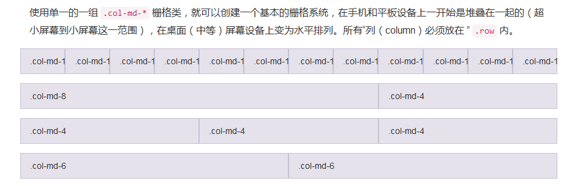

# 布局


```
<div class="row">
  <div class="col-md-1">.col-md-1</div>
  <div class="col-md-1">.col-md-1</div>
  <div class="col-md-1">.col-md-1</div>
  <div class="col-md-1">.col-md-1</div>
  <div class="col-md-1">.col-md-1</div>
  <div class="col-md-1">.col-md-1</div>
  <div class="col-md-1">.col-md-1</div>
  <div class="col-md-1">.col-md-1</div>
  <div class="col-md-1">.col-md-1</div>
  <div class="col-md-1">.col-md-1</div>
  <div class="col-md-1">.col-md-1</div>
  <div class="col-md-1">.col-md-1</div>
</div>
<div class="row">
  <div class="col-md-8">.col-md-8</div>
  <div class="col-md-4">.col-md-4</div>
</div>
<div class="row">
  <div class="col-md-4">.col-md-4</div>
  <div class="col-md-4">.col-md-4</div>
  <div class="col-md-4">.col-md-4</div>
</div>
<div class="row">
  <div class="col-md-6">.col-md-6</div>
  <div class="col-md-6">.col-md-6</div>
</div>
```


# 字号大小

```
.font-size-10 {
    font-size: 10px !important;
}
.font-size-11 {
    font-size: 11px !important;
}
.font-size-12 {
    font-size: 12px !important;
}
.font-size-13 {
    font-size: 13px !important;
}
.font-size-14 {
    font-size: 14px !important;
}
.font-size-16 {
    font-size: 16px !important;
}
.font-size-18 {
    font-size: 18px !important;
}
.font-size-20 {
    font-size: 20px !important;
}
.font-size-24 {
    font-size: 24px !important;
}
.font-size-26 {
    font-size: 26px !important;
}
.font-size-28 {
    font-size: 28px !important;
}
.font-size-36 {
    font-size: 36px !important;
}
.font-size-50 {
    font-size: 50px !important;
}

```


# 宽度
```
.width-50 { 
    width: 50px !important;
}
.width-80 { 
    width: 80px !important;
}
.width-100 { 
    width: 100px !important;
}
.width-120 { 
    width: 120px !important;
}
.width-150 { 
    width: 150px !important;
}
.width-160 { 
    width: 160px !important;
}
.width-180 { 
    width: 180px !important;
}
.width-200 { 
    width: 200px !important;
}
.width-250 { 
    width: 250px !important;
}
.width-300 { 
    width: 300px !important;
}
```


# 最小高度

```
.min-height30 { 
    min-height: 30px;
}
.min-height50 { 
    min-height: 50px;
}
.min-height60 { 
    min-height: 60px;
}
.min-height100 { 
    min-height: 100px;
}
.min-height150 { 
    min-height: 150px;
}
.min-height200 { 
    min-height: 200px;
}
.min-height250 { 
    min-height: 250px;
}
.min-height300 { 
    min-height: 300px;
}
.min-height350 { 
    min-height: 350px;
}
```


# 行高
```
.line-height16 { 
    line-height: 16px;
}
.line-height18 { 
    line-height: 18px;
}
.line-height22 { 
    line-height: 22px;
}
.line-height26 { 
    line-height: 26px;
}
.line-height28 { 
    line-height: 28px;
}
.line-height30 { 
    line-height: 30px;
}
```


# 字颜色-背景色


```
.color-444 {
    color: #444;
}
.color-666 {
    color: #666;
}
.color-8c {
    color: #8c8c8c;
}  
.color-999 {
    color: #999;
}  

.color-orange {
    color: #FF591F; 
}
.color-green {
    color: #16b267;
}

.bg-red-danger {
    background-color: #f00; 
}
.bg-orange {
    background-color: #FF591F; 
}
```

# 背景色


```
.bg-primary
.bg-success
.bg-info
.bg-warning
.bg-danger
```


# 对齐+加粗

```

.text-center {
    text-align: center !important;
}
.text-left {
    text-align: left !important;
}
.text-right {
    text-align: right !important;
}
.text-justify {
    text-align: justify;
}
.font-bold {
    font-weight: bold !important;
}
.font-normal {
    font-weight: normal;
}


```

# 块级元素-快速浮动-清除浮动

```
.display-block {
    display: block;
}
.display-teble {
    display: table;
    width: 100%;
}
.display-inlineblock {
    display: inline-block;
}
.pull-left {
    float: left;
}
.pull-right {
    float: right;
}
.clear {
    clear: both;
}

```

# 字删除线

```
.text-line-through  {
    text-decoration: line-through ;
}

```

# 鼠标形状-手

```
.cursor {
    cursor:pointer; 
}
```

# 基本样式清除

```
.list-style-none { 
    list-style-type: none; 
    padding: 0;
    margin: 0;
}
```

# 上边线

```
.border-top {
    border-top: 1px solid #e6e6e6;
}

```

# 图片形状

```


```

# 截断文本-以省略号代替
```
.text-overflow() {
  overflow: hidden;
  text-overflow: ellipsis;
  white-space: nowrap;
}
```

# 显示隐藏
```
.show {
  display: block !important;
}
.hidden {
  display: none !important;
}


```

# 字体图标


```
<i class="fa fa-university" ></i>

http://fontawesome.io/icons/

```

# 按钮样式


```
<button type="button" class="btn btn-default">（默认样式）Default</button>

<button type="button" class="btn btn-primary">（首选项）Primary</button>

<button type="button" class="btn btn-success">（成功）Success</button>

<button type="button" class="btn btn-info">（一般信息）Info</button>

<button type="button" class="btn btn-warning">（警告）Warning</button>

<button type="button" class="btn btn-danger">（危险）Danger</button>

<button type="button" class="btn btn-link">（链接）Link</button>

```


# 内边距-外边距  定义
```
.pad5A {
    padding: 5px !important;
}
.pad5T {
    padding-top: 5px !important;
}
.pad5R {
    padding-right: 5px !important;
}
.pad5B {
    padding-bottom: 5px !important;
}
.pad5L {
    padding-left: 5px !important;
}
.pad10A {
    padding: 10px !important;
}
.pad10T {
    padding-top: 10px !important;
}
.pad10R {
    padding-right: 10px !important;
}
.pad10B {
    padding-bottom: 10px !important;
}
.pad10L {
    padding-left: 10px !important;
}
.pad15A {
    padding: 15px !important;
}
.pad15T {
    padding-top: 15px !important;
}
.pad15R {
    padding-right: 15px !important;
}
.pad15B {
    padding-bottom: 15px !important;
}
.pad15L {
    padding-left: 15px !important;
}
.pad20A {
    padding: 20px !important;
}
.pad20T {
    padding-top: 20px !important;
}
.pad20R {
    padding-right: 20px !important;
}
.pad20B {
    padding-bottom: 20px !important;
}
.pad20L {
    padding-left: 20px !important;
}
.pad25A {
    padding: 25px !important;
}
.pad25T {
    padding-top: 25px !important;
}
.pad25R {
    padding-right: 25px !important;
}
.pad25B {
    padding-bottom: 25px !important;
}
.pad25L {
    padding-left: 25px !important;
}
.pad30A {
    padding: 30px !important;
}
.pad30T {
    padding-top: 30px !important;
}
.pad30R {
    padding-right: 30px !important;
}
.pad30B {
    padding-bottom: 30px !important;
}
.pad30L {
    padding-left: 30px !important;
}
.pad45A {
    padding: 45px !important;
}
.pad45T {
    padding-top: 45px !important;
}
.pad45R {
    padding-right: 45px !important;
}
.pad45B {
    padding-bottom: 45px !important;
}
.pad45L {
    padding-left: 45px !important;
}
/* Remove paddings */

.pad0A {
    padding: 0 !important;
}
.pad0T {
    padding-top: 0 !important;
}
.pad0R {
    padding-right: 0 !important;
}
.pad0B {
    padding-bottom: 0 !important;
}
.pad0L {
    padding-left: 0 !important;
}
/* Margins */

.mrg5A {
    margin: 5px !important;
}
.mrg5T {
    margin-top: 5px !important;
}
.mrg5R {
    margin-right: 5px !important;
}
.mrg5B {
    margin-bottom: 5px !important;
}
.mrg5L {
    margin-left: 5px !important;
}
.mrg10A {
    margin: 10px !important;
}
.mrg10T {
    margin-top: 10px !important;
}
.mrg10R {
    margin-right: 10px !important;
}
.mrg10B {
    margin-bottom: 10px !important;
}
.mrg10L {
    margin-left: 10px !important;
}
.mrg15A {
    margin: 15px !important;
}
.mrg15T {
    margin-top: 15px !important;
}
.mrg15R {
    margin-right: 15px !important;
}
.mrg15B {
    margin-bottom: 15px !important;
}
.mrg15L {
    margin-left: 15px !important;
}
.mrg20A {
    margin: 20px !important;
}
.mrg20T {
    margin-top: 20px !important;
}
.mrg20R {
    margin-right: 20px !important;
}
.mrg20B {
    margin-bottom: 20px !important;
}
.mrg20L {
    margin-left: 20px !important;
}
.mrg25A {
    margin: 25px !important;
}
.mrg25T {
    margin-top: 25px !important;
}
.mrg25R {
    margin-right: 25px !important;
}
.mrg25B {
    margin-bottom: 25px !important;
}
.mrg25L {
    margin-left: 25px !important;
}
.mrg35A {
    margin: 35px !important;
}
.mrg35T {
    margin-top: 35px !important;
}
.mrg35R {
    margin-right: 35px !important;
}
.mrg35B {
    margin-bottom: 35px !important;
}
.mrg35L {
    margin-left: 35px !important;
}
.mrg45A {
    margin: 45px !important;
}
.mrg45T {
    margin-top: 45px !important;
}
.mrg45R {
    margin-right: 45px !important;
}
.mrg45B {
    margin-bottom: 45px !important;
}
.mrg45L {
    margin-left: 45px !important;
}
.mrg50T {
    margin-top:50px !important;
}
.mrg50R {
    margin-right: 50px !important;
}
.mrg50B {
    margin-bottom: 50px !important;
}
.mrg50L {
    margin-left: 50px !important;
}

.mrg100T {
    margin-top:100px !important;
}
.mrg100R {
    margin-right: 100px !important;
}
.mrg100B {
    margin-bottom: 100px !important;
}
.mrg100L {
    margin-left: 100px !important;
}


/* Remove margins */

.mrg0A {
    margin: 0 !important;
}
.mrg0T {
    margin-top: 0 !important;
}
.mrg0R {
    margin-right: 0 !important;
}
.mrg0B {
    margin-bottom: 0 !important;
}
.mrg0L {
    margin-left: 0 !important;
}
```


