# 前端综述


# nodejs


[Node.js](https://nodejs.org/en/) 是一个基于 [Chrome V8](https://developers.google.com/v8/) 引擎的 JavaScript 运行环境。Node.js 使用了一个事件驱动、非阻塞式 I/O 的模型，使其轻量又高效。Node.js 的包管理器 [npm](https://www.npmjs.com/)，是全球最大的开源库生态系统

# AngularJS

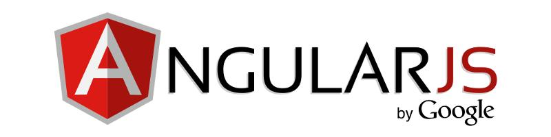

AngularJS是web应用的下一个巨头。

AngularJS如果为创建web应用而设计，那它就是HTML的套路了。具有数据绑定, MVW, MVVM, MVC, 依赖注入的声明式模板和出色的可测试性都是用纯客户端 JavaScript来实现的! AngularJS 是一个创建富客户端应用的JavaScript MVC框架，它组织良好，经过严格测试,多功能，强大并且十分灵活。你仍然需要具有服务端后台，但大多数的用户交互逻辑将优雅地放到客户端上处理。

AngularJS是一个开源的web应用框架，由Google和社区进行维护，它可以创建单页的应用程序，一个页面的应用仅仅需要HTML,CSS和JavaScript在客户端。它的目标是增强页面的模型-视图-控制（MVC）的功能，为简化开发和测试。
它是一个建立在厚客户端的清爽的新模块web应用程序。一个健壮的框架建立在商业应用网络上。它鼓励最佳实践，开发模型和开发高质量的可维护的模块化应用程序。它的团队是世界一流的，社区是极其出色的，它结合最棒的功能来创建web应用。

AngularJS允许你编写客户端的web应用程序，如果你有一个智能浏览器。它允许你使用好用的旧式的HTML作为你的模板语言，允许你扩展HTML语法来清晰、简洁的表达你的应用组件。它通过双向数据绑定使你的UI（视图层）与你的JavaScript对象（模型层）的数据自动同步。帮助你更好的构建你的应用和更方便的测试，AngularJs告诉浏览器如何依赖注入和控制反转。它帮助改良了允许异步回调和延迟、使客户端导航和深层链接使用哈希bang格式地址和HTML5 pushStat与服务端通信更容易。

Angular 提供了：

- 结构模型的引入（MVC,SPA等）
- 增强HTML支持新特性。
- 避免直接DOM操作来避免很难调试不可追踪的代码。
- 包含低耦合和高可复用性
- 应用程序内部规则测试
- 视图模板更接近服务器端模板

AngularJS 是基于声明式编程模式 是用户可以基于业务逻辑进行开发. 该框架基于HTML的内容填充并做了双向数据绑定从而完成了自动数据同步机制. 最后, AngularJS 强化的DOM操作增强了可测试性.

设计初衷:

- 将ＤＯＭ操作从应用中解耦. 增强了可测试性。
- 应用测试性与开发代码同样重要. 测试的复杂程度与代码的设计结构强相关.
- 客户端与服务端解耦. 实现了并发处理机制增强了代码复用性.
- 在开发全过程中作出指引: 从ＵＩ到业务逻辑最终到测试环节.

## 架构

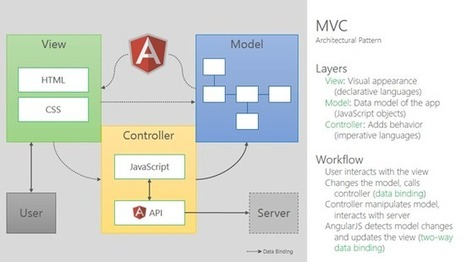


## AngularJS的关键特性

可测试性，依赖注入，逻辑/视图层的分离，还有设计者和开发者之间的协调合作是一个开发者对一个框架最期待的几样东西。Angular绝对满足上述要求。在JS领域，Angular能适配这写令人耳目一新的要求看起来是多么惊人。


###  双向数据绑定:

数据绑定可能是AngularJS里最酷，最实用的功能。 它将节省你大量的样板代码编写。 一个典型的Web应用程序可以包含多达80％的代码基础，如遍历，操作，并听取了监听DOM。 数据绑定使得不用编写这些代码，这样你就可以专注于你的应用程序。

考虑下你的应用程序的模型为单源信任的。 你的模型就是你去读取或更新应用程序中的任何东西的地方。这种投射是无缝的，不需费你一兵一卒。AngularJS双向数据绑定会处理DOM和模型之间的同步，反之亦然。


### 模板

在AngularJS, 模板就是原生的HTML. 做了基于视图的增强. 这样做最大的好处在于拉近了开发与设计人员的工作流. 设计人员操作ＨＴＭＬ完成设计，开发直接在ＨＴＭＬ上作相应的功能开发。

```
<div ng-controller="AlbumCtrl">
  <ul>
    <li ng-repeat="image in images">
      
    </li>
  </ul>
</div>

```

### MVC

AngularJS引入了软件设计的ＭＶＣ模式.这对于使用者来说仁者见仁智者见智. AngularJS并不是完全的ＭＶＣ而是 MVVM (Model-View-ViewModel).

- 模型
model就是数据模型 就是一些JavaScript 对象. 没必要从父类继承，代理包装亦或是使用getter/setter来使用. 使用vanilla JavaScript 十分方便便捷.
- 视图
视图就是提供特殊数据或方法来支持特定场景的对象.
视图对象就是 $scope. $scope就是个简单的js对象，提供一些简单的ＡＰＩ监控其状态.
- 业务控制
控制器起到设置 $scope对象的初始状态及后续的动作关联。 
- 页面
在.AngularJS处理完相关的业务逻辑进行ＨＴＭＬ模式的展示。
这样就奠定了应用的架构.  $scope对象拥有数据的引用关系, 控制器定义行为, 视图处理页面展示布局以及相应的处理跳转.

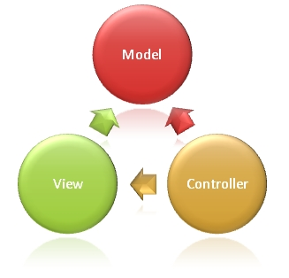

### 依赖注入

AngularJS 提供了依赖注入的子系统帮助开发人员降低开发复杂度，提高测试效率.依赖注入将业务代码与配置实现解耦，提高了代码的可测性. 
有了ＤＩ无需每次都创建指定的对象依赖关系，而后面配置. 这样就能按需分配而无需自己制定或是查找. 就像要说一句"Hey I need X', ＤＩ就会帮你创建并发送给你.
采用依赖注入后能体验到的好处主要包括:
- 代码更易于维护。
- API更为简练和抽象。
- 代码更易于测试。
- 代码更加模块化、可复用性更强。


### 指令

指令可以被用来创建自定义的HTML标签，这些标签可以用作新的自定义的控件。它们也可以用来"渲染"有一定行为的元素，也可以以一些有趣的方式来操 作DOM属性。一个指令就是一个能引入新语法的东西。把分离的组件组合成一个组件，这种创建应用的方式将使得添加、修改和删除页面功能变得异常简单。指令 是AngularJS的一个非常强大且独有的特性。
从更高的层次说,  DOM 元素上的指令 (像是属性，元素名，注释或是 CSS ) 等给 AngularJS's HTML 编译器传递的数据($compile) 从而传递指定的功能到ＤＯＭ元素或是子元素。
Angular 有很多这样的内置指令，像是 ngBind, ngModel, 和ngView.Y还能自定义指令，当Angular启动后HTML编译器就会自动建立ＤＯＭ元素的指令映射.

### 测试
AngularJS 意识到凡是js写的代码需要加强测试. 这在 AngularJS 设计之初就有了, 于是Angular的可测试性不言而喻.
JS是解释性的动态语言，设计相应的测试决不可小觑.
AngularJS 完全基于可测的根基设计出来的. 它提供了端到端的单元测试. API文档就是详细的测试覆盖说明. 

## AngularJS Bootstrap Process

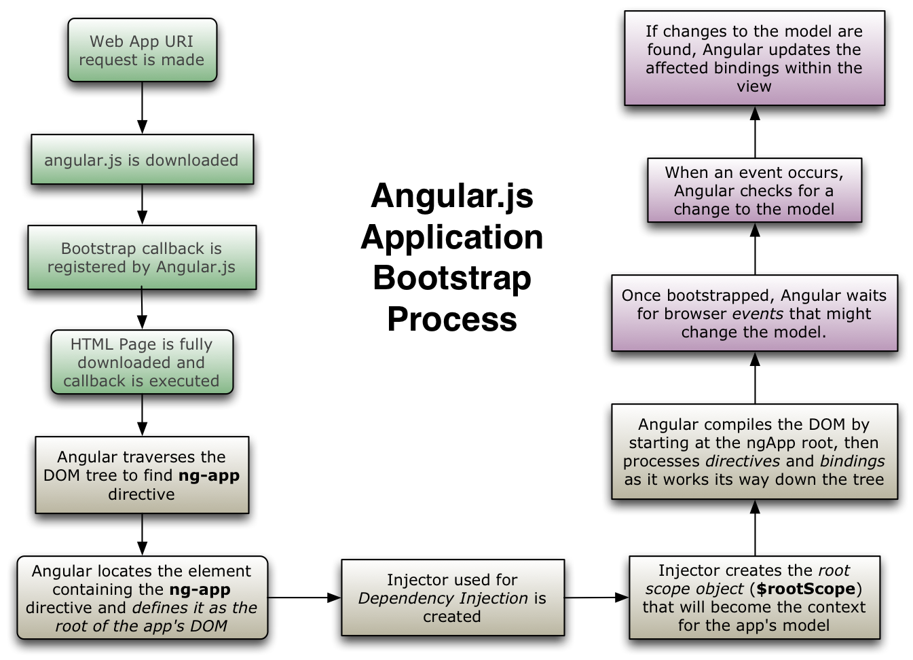

## 学习曲线

刚开始学Augular觉得开发应用需要有相当的编程基础. 不得不说这确实是一款了不起的开发框架，它要求开发人员设计低耦合和可维护的应用. 使用AngularJS 的复杂度就像使用PHP，Ruby on Rails等等, 都需要处理依赖注入，路由，值域等等. 这也不是什么新技术了. Angular只是发扬光大了.

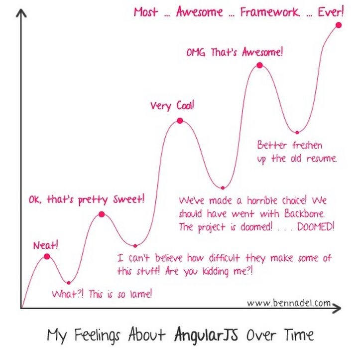

## JS MVC frameworks

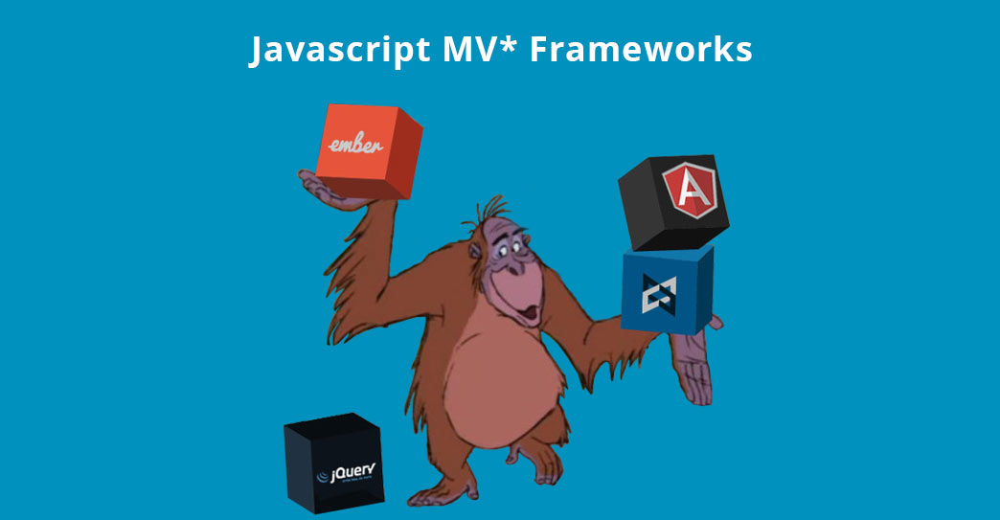

MVC (模型-视图-控制器) 是一套设计模式，可以分层设计应用. 将数据(模型) 与用户视图 (视图)解耦, 通过中间控制器 (Controllers) 处理业务逻辑， 用户输入以及相应的逻辑跳转. 现代JS框架提供了简易的操作以及SoC (业务分离) 更好的实现了MVC .
MVC 对于JS有很多好处— 提高了高可靠性的代码. 已被很多语言大量测试验证过，具有高可靠性.
MVC 实现的三层结构:

1. 模型: 是应用程序中用于处理应用程序数据逻辑的部分。通常模型对象负责在数据库中存取数据.
2. 视图: 是应用程序中处理数据显示的部分。通常视图是依据模型数据创建的.
3. 控制: 是应用程序中处理用户交互的部分。通常控制器负责从视图读取数据，控制用户输入，并向模型发送数据.

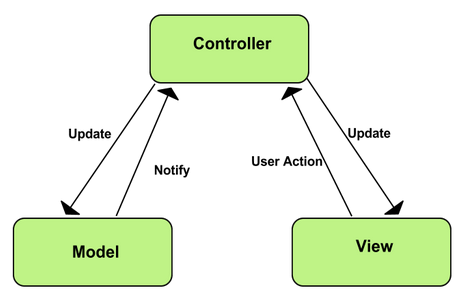

JavaScript ‘MVC’可以帮助构建我们的代码，但尽信书不如无书. 有些框架把控制器放在视图模式(比如 Backbone.js) 有些框架全部混在一起使用. 除此外还有其他的MVC模式，像是 MVP (Model-View-Presenter) and MVVM (Model-View ViewModel). 即便是MVC设计模型, 不同的语言也有不同的实现方式. 像是, 有些MVC实现会有自己的视图变更控制器亦或是控制器视图. 这些框架被称为 MV* 框架, 意味着你会有模型，视图但更会有其他的部分. 
很长一段时间 AngularJS 是很标准的 MVC (或者说在客户端实现这一块),但在后来一段时间内随着代码重构和API的重写，现在更是 MVVM模式了 –  $scope 对象被认为是视图模型然后被称为控制器的功能模块包装. 这样分配到MV模式中是有些好处的.它会帮助开发者使用简易的API开发基于框架的代码. 也能统一开发的共识。 使用MVC的初衷就是分解结构, 然后通过设置参数决定具体使用哪种 MV* 框架, Igor Minar (核心 AngularJS团队)宣称AngularJS 是 MVW 框架- Model-View-Whatever. whatever就是定制化的需求.

## 为什么使用 JS MVC 框架

再来看看使用MVC和传统开发模式的区别
传统Web应用


传统模式处理业务请求全部放在服务端，前段只是页面交互 (瘦客户端, 胖服务端). 这会有以下问题:
- 分布式处理能力弱 – 服务器处理大量业务，性能堪忧.
- 相应压力 – 传统应用的响应速度是个硬伤.
- 开发复杂度 –C/S结构的应用开发是比较复杂的. 由于每次请求响应都涉及到交互设计，很容易出错。未解决该问题的框架也是层出不穷，可惜易用性有待考究.
- 被攻击危险 – 混编业务代码和交互代码，增加了代码受攻击的概率.在复杂度很高的应用中更是不容易控制安全性。
- 服务端的负载过大 – 所有客户端的请求都需要经由服务端处理，这意味着所有的session都要等待30分钟后才能被释放，这时客户请求早已处理完毕，但还在占用系统资源，大大降低了系统性能和伸缩性.
- 离线处理 – 拥有离线处理能力是web应用的竞争力，尤其在处理大量客户端请求的应用中，离线处理部分业务更是不可或缺.
- 互操作性弱– 由于混杂编写，代码逻辑很难分割，扩展功能变得复杂.

JSMVC Web 应用程序

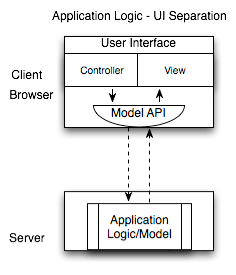

JS MVC web应用程序架构主要致力于将服务端的逻辑处理转移到客户端和实现瘦客户端web应用程序。client/server模型的处理逻辑和代码被委托给浏览器的好处是：
- 可扩展性：很容易看到利用客户端处理在可扩展性方面的优势。服务器处理能力保持不变的前提下，应用被越多的客户使用，那么越多的客户端机器可以被使用（直到你购买更多的服务器）。
- 实时的用户响应：客户端代码可以立即对用户的输入作出反应，而不需要等待网络传输。
- 结构清晰的编程模型：用户界面可以有效地分离应用程序的业务逻辑。这样的模型为安全提供了一个更加简洁方法。所有通过用户界面的发出的请求，我们可以在数 据通过各种接口前进行安全检查。使用复杂的分析流程会让安全分析变得更加复杂。另一方面，用清晰的web服务接口，有明确的网关安全工作和安全分析更简单 直观，漏洞可以快速发现并纠正。
- 客户端状态管理：在客户端维护临时会话状态信息可以减少服务器上的内存负载。这也允许客户利用更多的RESTful交互，可以进一步提高可伸缩性和使用缓存的时机。
- 离线应用-如果大部分应用程序的代码已经在客户端上运行，那么创建一个离线版本的应用程序可以肯定将会变得更加容易。
- 互操作性：通过使用结构化数据和最小限度的api进行交互，这样更容易连接额外的消费者和生产者与现有系统进行交互。

为了开发实现一个客户端web应用程序，需要组织我们的项目结构，这样更易于后期的管理和维护。一个应用程序的脚本超过几十行的时候，如果它的组件之 间的功能没有分开处理，这样应用会变得越来越难管理。我们一开始开发一个web应用程序的时候，可能会觉得简单地通过一个DOM操作库（如jQuery） 和一些实用的插件就可以完成了。这样我们很容易就被应用里面jQuery的嵌套回调函数和没有任何组织结构的DOM元素给搞蒙了。为了避免前面说到的问 题，我们采用spaghetti code （一个描叙代码的术语，用来形容代码难以阅读和因为缺乏组织结构难以维护）。像使用jQuery这样的DOM操作库和一些其他的实用库我们可以 更加容易使构建一个网页。但是，这些库在我们构建web应用程序时失去作用。
web应用程序不像一个普通的网页，他们更倾向于与用户的交互并且需要实时与后端服务器通信。如果你没有使用MVC框架来处理，这样会最终会让你写出 一些编写混乱、非结构化、不可维护、不可测试的代码。为了避免“spaghetti”式的代码，那么JavaScript开发人员必须首先要了解这种模式 提供了什么东西。这就可以看到这些框架能够让我们做什么哪些不同的事情。
使用JavaScript构建一个单页面应用程序的时候，不管是否拥有一个复杂的用户界面或者只是为了减少HTTP请求的数量，你可能会发现自己写的 很多可以组成一个MV *框架的代码。刚开始的时候，使用自己想出来的方式来避免“spaghetti”式代码写一个应用框架并不是一件很难的事情，但是写出像 Angular/Backbone这样的代码水平那就不太可能了。
我们会发现有更多的人会倾向于构建一个应用，而不是试着去将DOM操作库、模板、路由结合到一起。成熟的MV *框架通常不仅包括很多你发现自己写过的类似的功能代码，而且也包含了很多你曾经遇到并且已经解决了的问题。框架为你节省了很多时间，这就是框架不能低估 的价值所在。
现在的浏览器提供了丰富的功能，变得越来越强大，这不仅让在JavaScript中构建成熟的web应用程序成为可能，而且这个方式越来越受欢迎。根据 HTTP Archive数据显示，今年部署的JavaScript代码规模增长了45%。

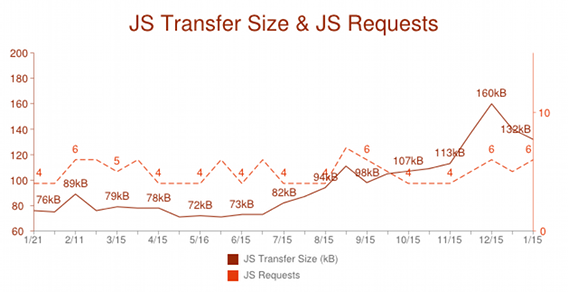

　随着JavaScript的人气攀升， 我们的客户端应用程序比以前复杂得多 。一个应用程序开发需要多个开发人员合作，所以编写可维护和可重用代码在新的web应用程序时代是非常重要的。设计模式对于编写可维护和可重用的代码是很 重要的。在过去几年时间里面，有很多JavaScript MVC框架已经被设计开发出来了，比如AngularJS，backbone.js， ember.js，还有很多其他的框架。虽然他们都有其独特的优势，但是每一框架都会鼓励开发人员遵循一定的形式以编写出更加结构化的 JavaScript代码。

## 什么时候需要使用一个JS MV*框架

如果你在构建一个应用，它的客户端有许多重量级的功能，用纯JavaScript很难应付，那你就应该考虑使用一个MVC框架。 如果选择错误，你将会错过MVC框架提供的功能，陷入重新发明轮子的境地。
要注意的是，如果你构建的应用在服务器端有很多重量级功能(即视图生成/展现逻辑)并且在客户端没有多少交互的话，这时你会发现使用MVC框架就像是杀鸡用牛刀。在那种情况下更好的选择是，使用一个更简单的、有少量附加功能的DOM操控类库。
下面这个列表并不完备，但是我们希望它能提供充分的理由帮你决定是否在你的应用中应该使用一个MVC框架:
- 你的应用需要异步连接到后台
- 你的应用有这样的功能，它不需要重新载入整个页面(比如给博文增加一条评论，无下限滚动)
- 多数视图或者数据操作将会在浏览器内完成，而不是在服务器端完成
- 同样的数据在页面上需要进行不同方式的渲染
- 你的应用有许多琐碎的交互来修改数据(按钮, 开关)

　　满足这些情况的比较好的web应用的例子有Google Docs，Gmail或者Spotify。

## 客户机/服务器架构的web应用程序

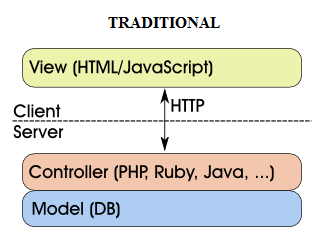

　客户端一侧的MVC可以处理整个MVC栈。如果你同时使用服务器和客户端MVC，那么你会复制你的模型和路径。客户端一侧的MVC基本上允许你将你的 服务器和客户端连接起来。为什么你的服务器要发送视图层？为什么不发送以json为格式的模型并加载它到客户端一侧，让客户端去渲染视图。你甚至可以在将 来为其规定路由。为什么服务器要处理路由？客户端可以做这个。仅仅允许客户端去访问你的RESTful数据库就行，并且你不需要任何服务器端的MVC。

　　较流行的一种包含客户端服务端的模式是 后端RESTful API 通过 JSON发送数据模型 客户端使用MVC模式 处理应用.

## Client-side MVC with server-side RESTful API


## Data Flow

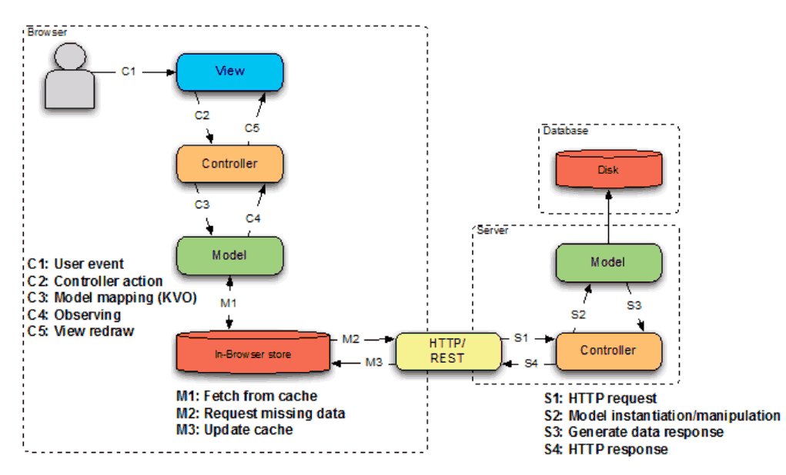

## AngularJS和其他JS MVC框架的对比

在与其他JS MVC框架的争战中，AngularJS已经胜利了。它已经证明了自己是所有JS MVC框架中最成熟的。下面是来论证的数据
社区支持
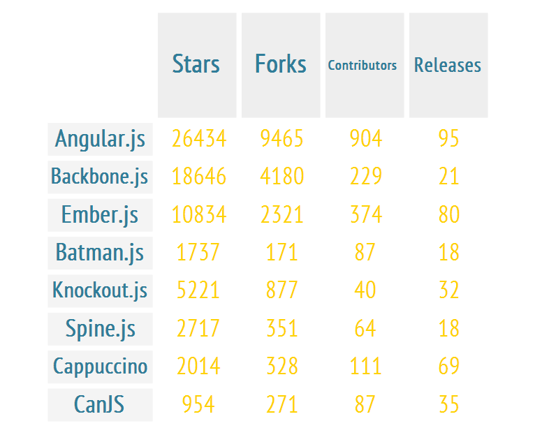

（数据来自Github.com）

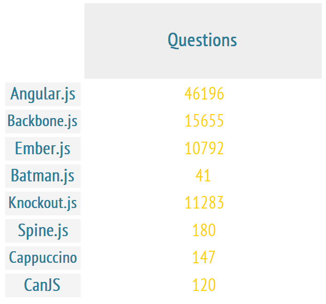

（数据来自StackOverflow.com）随着时间推移，兴趣的趋势


（2011年8月-2014年6月）

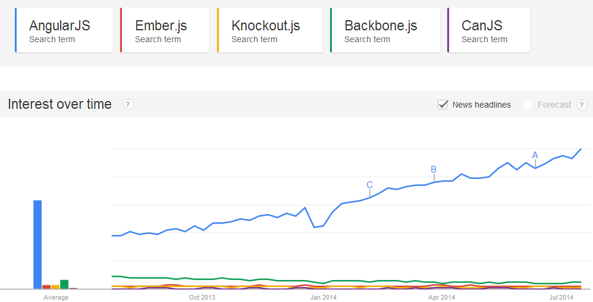

（上一年）使用统计


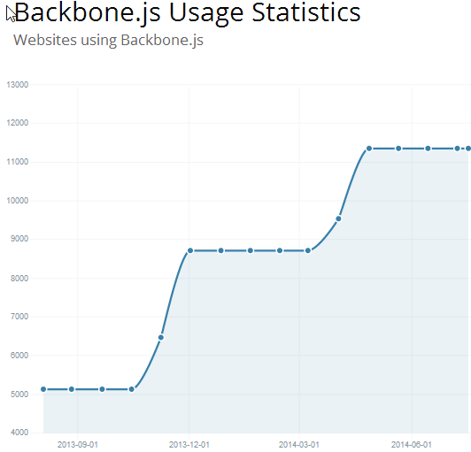

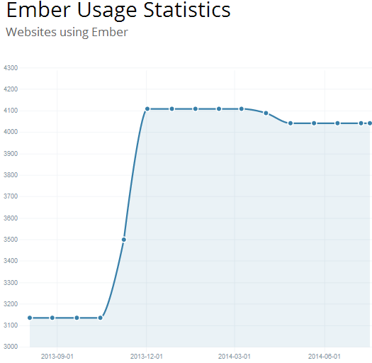

特性对比

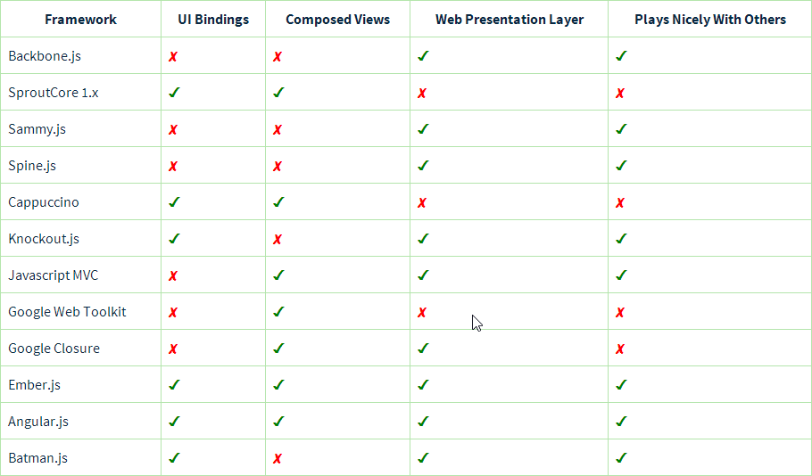
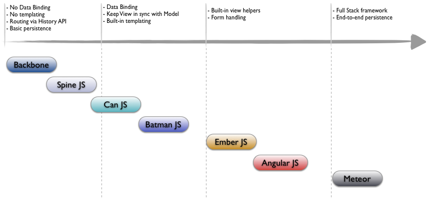

用户入门

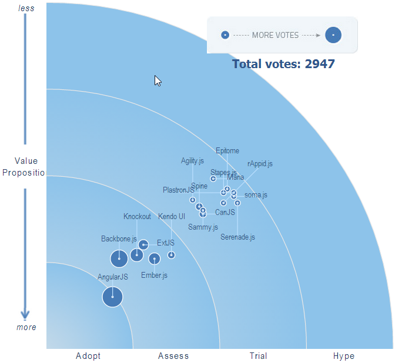
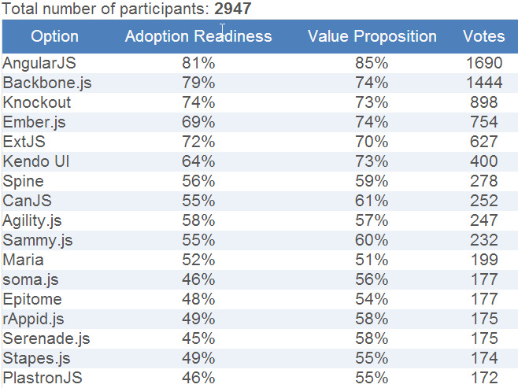

工作趋势


## 对比Angularjs和类似Dojo的企业级工具集(Toolkit)

Dojo Toolkit:

　　Dojo Toolkit是一个致力于简化跨平台JavaScript/Ajax应用和网站的开源模块化JavaScript类库. Dojo是一个面向大规模客户端web开发的JavaScript框架. 例如, Dojo抽取出一个屏蔽各种浏览器差异的API集合. 此外, Dojo的功能还包含: 定义了模块化代码的框架, 并管理他们的相互依赖关系;  提供构建工具集, 可以用来优化JavaScript和CSS代码, 生成文档并且运行单测; 支持国际化, 本地化和无障碍(accessibility); 提供了丰富了通用工具类和用户界面组件(Widget).

- 社区支持
- MVC
   Angular开发团队已经将MVC设计模式以多种方式引入到Angular中, 因此会使得开发也必须跟随这MVC设计模式. AngularJS并没有以传统的方式实现MVC, 而是更接近于MVVM(Model-View-ViewModel), 因此有时被统称为MV*. MVC是Angular的核心, Angular为MVC设计模式提供了原生的支持, 可以轻易将其应用于web应用程序的开发中.

　　Dojo的Toolkit为JS应用程序提供了实现MVC的独立工具包. Dojo并没有为JS应用程序提供完备的MVC实现, 而是根据应用程序自身需要, 选择性使用其中的MVC工具/组件. Dojo提供MVC功能的包是dojox/mvc.这个dojox/mvc包主要关注客户端的View到Model的数据绑定, 仅提供了在一个View中的数据绑定/控制器的支持, 并未提供在应用程序级别的跨多个View的支持(例如, 导航(Navigation)的支持). 

　　在Dojo中，MVC应用中的级别关注点比如路由或者导航等必须使用另一个包(dojox/app)来处理，而在AngularJS框架中，这些关注点都是框架自身就能处理的。
dojox/mvc模块的状态现在仍然是“Experimental” ，所以它仍然是不稳定的，正如下面这篇文章所说的(http: //dojotoolkit.org/reference-guide/1.10/dojox/index.html#dojox-index)，而 Angular则是一个经过了更多的验证、稳定而成熟的JS MVC框架。


- SPA AngularJS是一个流行的全功能的SPA框架。AngularJS的一些固有特性支持了单页面应用的开发。Angular通过下列特性来支持SPA:

## 总结

本文意图让我们知晓web应用的未来就在眼前。并尝试概述一个正确的有指导意义的方法来结构化和设计一个web应用，使之能适应web世界。本文概述了客户端JS MV*框架的使用，并说明了为什么用客户端MVC框架组织的web应用很适合实现web应用。

　　本文集中分析和总结了在成熟的客户端MVC框架下的对比，并提供一些对比的统计信息，帮助你和你的团队决策，选择出适合你的web应用的客户端MVC框架。

　　本文偏向于AngularJS框架，你可以有不同的偏好。对我来说AngularJS是我个人的喜好所在，在我眼中是其他客户端MVC框架所不能匹敌的。


#  前端资源教程

http://cnodejs.org/topic/56ef3edd532839c33a99d00e